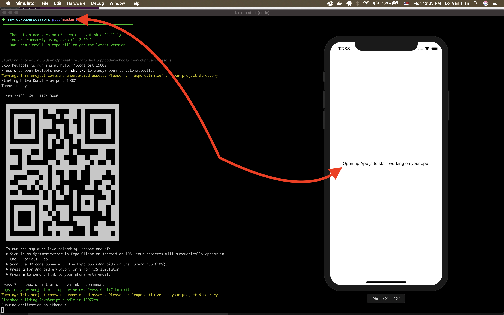
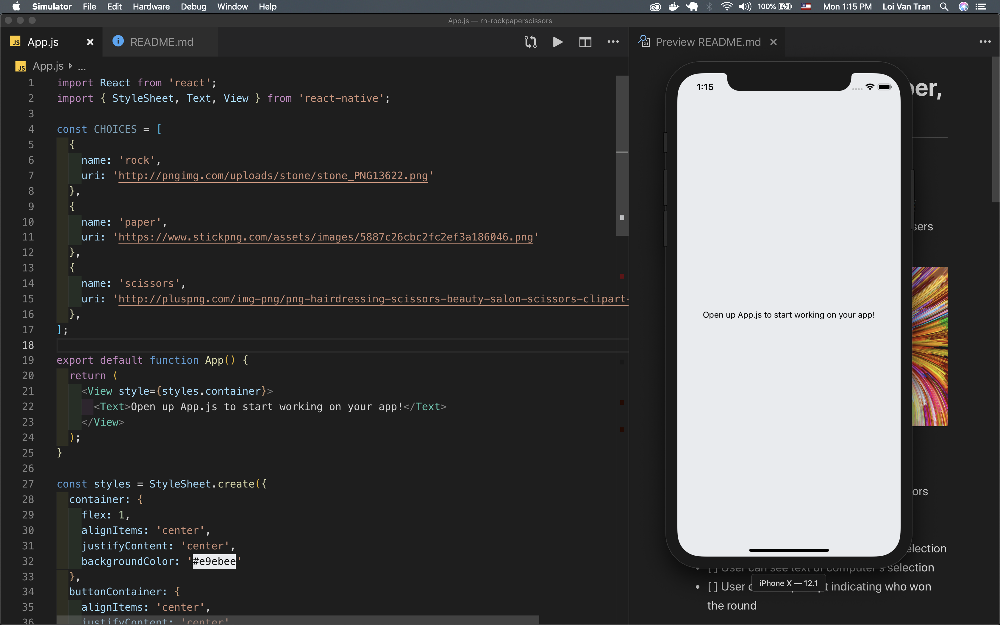
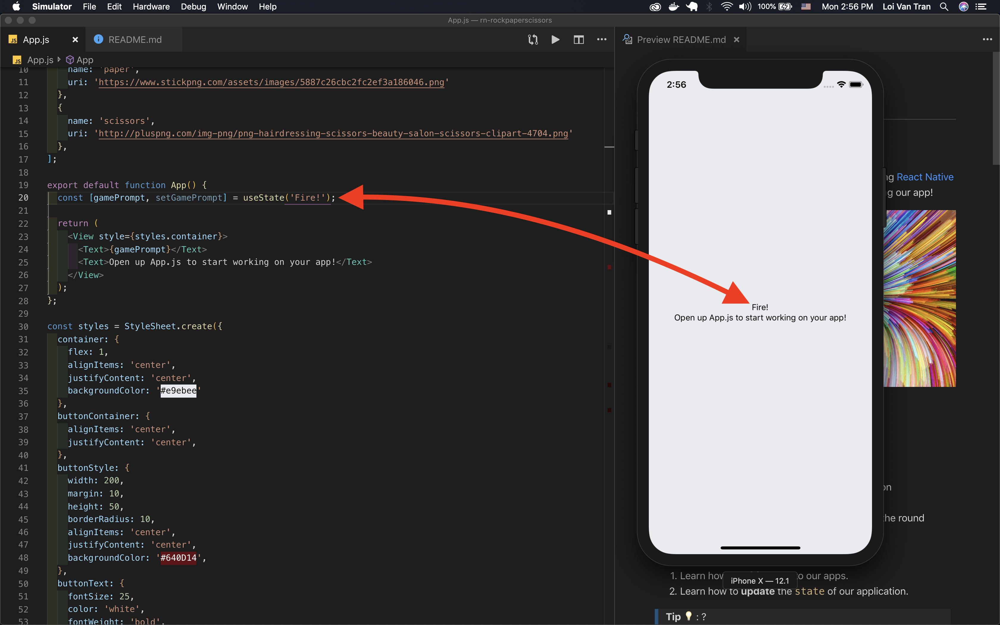
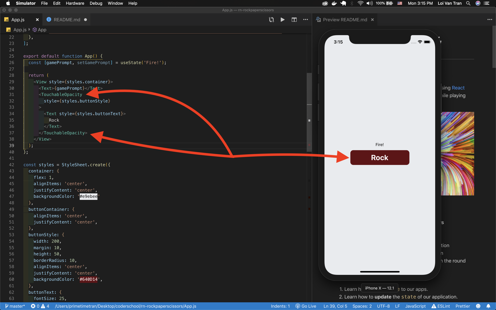
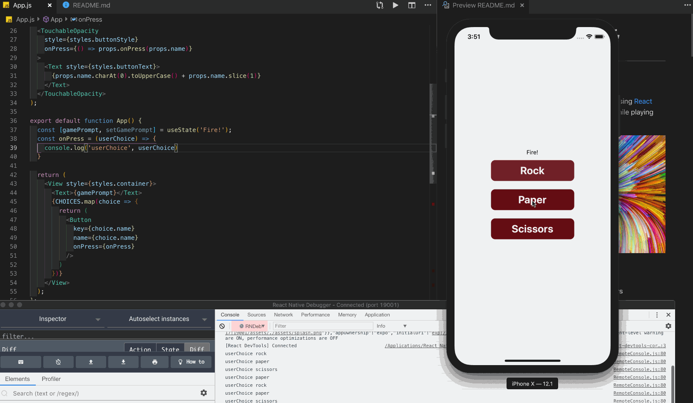
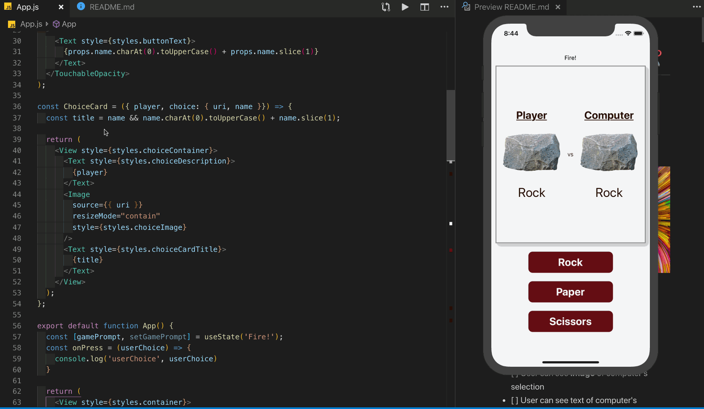
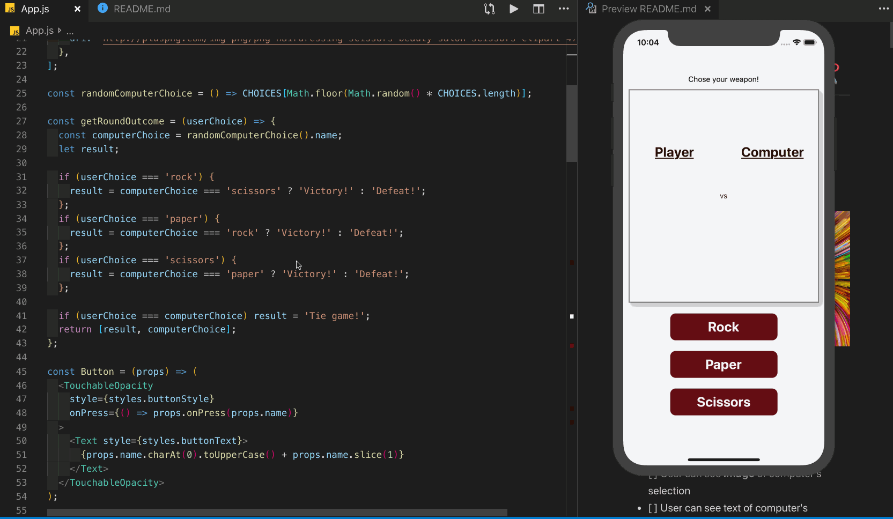
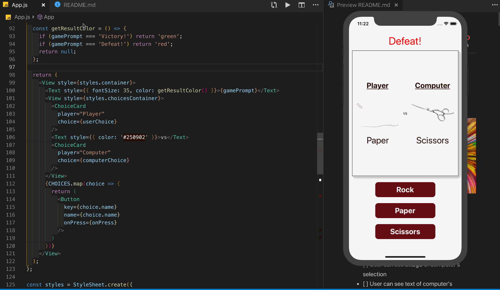

# WK5 - HW - **Rock, Paper, Scissors 🧗‍🗞️✂️**

## Introduction 🌟

Let's build a Rock, Paper, Scissors game app 📱 using [React Native](https://facebook.github.io/react-native/) & [Expo](https://expo.io/). Our app will help users have fun!


### Features 🎯🥇🏆

- [ ] User can select **Rock**, **Paper**, or **Scissors**
- [ ] User can see **image** of their selection
- [ ] User can see text of their selection
- [ ] User can see **image** of computer's selection
- [ ] User can see text of computer's selection
- [ ] User can see **prompt** indicating who won the round

### Learning Objectives ✍️📚📝

1. Learn how to **add** `state` to our apps.
2. Learn how to **update** the `state` of our application.

> **Tip** 💡: ?

### **Milestone 1 🛣🏃 Set up app, styling, & data**

**A)** Use `expo init` command to create a new project. I'm calling mine `rn-rockpaperscissors`.



**B)** Add necessary styles.

The focus of this homework assignment is `state` so you can just copy these `styles`. Replace the `StyleSheet.create()` call at the bottom of your `App` component.

<details>

<summary>New Styles</summary>

```jsx
const styles = StyleSheet.create({
  container: {
    flex: 1,
    alignItems: 'center',
    justifyContent: 'center',
    backgroundColor: '#e9ebee'
  },
  buttonContainer: {
    alignItems: 'center',
    justifyContent: 'center',
  },
  buttonStyle: {
    width: 200,
    margin: 10,
    height: 50,
    borderRadius: 10,
    alignItems: 'center',
    justifyContent: 'center',
    backgroundColor: '#640D14',
  },
  buttonText: {
    fontSize: 25,
    color: 'white',
    fontWeight: 'bold',
  },
  choicesContainer: {
    margin: 10,
    borderWidth: 2,
    paddingTop: 100,
    shadowRadius: 5,
    paddingBottom: 100,
    borderColor: 'grey',
    shadowOpacity: 0.90,
    flexDirection: 'row',
    alignItems: 'center',
    backgroundColor: 'white',
    justifyContent: 'space-around',
    shadowColor: 'rgba(0,0,0,0.2)',
    shadowOffset: { height: 5, width: 5 },
  },
  choiceContainer: {
    flex: 1,
    alignItems: 'center',
  },
  choiceDescription: {
    fontSize: 25,
    color: '#250902'
    fontWeight: 'bold',
    textDecorationLine: 'underline'
  },
  choiceCardTitle: {
    fontSize: 30,
    color: '#250902'
  },
  choiceImage: {
    width: 150,
    height: 150,
    padding: 10,
  }
});
```

</details>

**C)** Define the choices a user can make in **Paper, Rock, Scissors** above our `App` component. Notice what we define, an `array` of `objects`.

<details>

<summary>Rock, Paper, & Scissors Choices</summary>

```javascript
const CHOICES = [
  {
    name: 'rock',
    uri: 'http://pngimg.com/uploads/stone/stone_PNG13622.png'
  },
  {
    name: 'paper',
    uri: 'https://www.stickpng.com/assets/images/5887c26cbc2fc2ef3a186046.png'
  },
  {
    name: 'scissors',
    uri: 'http://pluspng.com/img-png/png-hairdressing-scissors-beauty-salon-scissors-clipart-4704.png'
  },
];
```

</details>



We should see that nothings changed. That's ok, we're just setting up some stuff to make our lives easier in just a few moments.

> **Key Points** 🔑📝

- It's ok to hardcode sometimes. **Rock**, **Paper**, **Scissors** will only ever have these 3 choices after all!

---

### **Milestone 2 🛣🏃 Setup game prompt**

Let's take a moment to think about our application. The user selects one of the three choices, then the prompt displays **Victory!**, **Defeat!**, or **Tied!**.

This prompt will **change** over time following the **state** of the **app**.

In other words, the prompt is **stateful**.

#### We need to introduce state to our app

**A)** Import a required dependency from React, `useState`, which allows us to introduce state to our functional components.

```jsx
import React, { useState } from 'react';
```

**B)** In the body of our `App` component, define two new variables, `gamePrompt` & `setGamePrompt`.

```jsx
const [gamePrompt, setGamePrompt] = useState('Choose your weapon!');
```

The `useState` call returns an array. It's argument is the initial value of the first index of the `array`, a **state variable**. Our state variable is defined as `gamePrompt` in this case. The second is called a [setter method](https://javascriptplayground.com/es5-getters-setters/).

  - The **1st** index of the array is a variable that **holds** state.
  - The **2nd** index of the array is a function that **changes** state.

**C)** Add the `gamePrompt` piece of state to our `App` component's body.

```jsx
<Text>{gamePrompt}</Text>
```

We should now see something like this below


**D)** Confirm the value of `gamePrompt` is coming from the argument of `useState`.

Change the argument to `useState` and reload your simulator. You should see it changes to whatever you added, in my case, **Fire!**.



> **Key Points** 🔑📝

- With the `useState` function from React we can add statefulness to our functional components.
- `useState()` returns an array.
- The **1st** index of the array returned from `useState` is the stateful variable. We can give it any initial value we want such as `String`, `Boolean`, `Array`, `Object`, etc...
- The **2nd** index of the array returned from `useState` is a function which updates the state variable.

---

### **Milestone 3 🛣🏃 Add buttons which allow user to make selection**

**A)** Import `TouchableOpacity` from React Native.

```jsx
import {
  TouchableOpacity,
} from 'react-native';
```

**B)** Render a single `TouchableOpacity` in the body of `App`'s return with one of the selection choices.

```jsx
<TouchableOpacity
  style={styles.buttonStyle}
>
  <Text style={styles.buttonText}>
    Rock
  </Text>
</TouchableOpacity>
```

We should now see a screen that looks something like this.



However, we have a problem, when we click our `TouchableOpacity`, nothing happens.


**C)** Pass an `onPress` prop to `TouchableOpacity`, the prop being a function which console.logs.

```jsx
<TouchableOpacity
  onPress={() => console.log('Mic check, 1 2, 1 2')}
  style={styles.buttonStyle}
>
  <Text style={styles.buttonText}>
    Rock
  </Text>
</TouchableOpacity>
```

We should now see something happening in our debugging console, confirming our `TouchableOpacity` is working.


**D)** Create a new component, `Button`, so we can use this code again for the three available choices a user can make, `Rock`, `Paper`, & `Scissors`.

```jsx
const Button = (props) => (
  <TouchableOpacity
    style={styles.buttonStyle}
    onPress={() => props.onPress(props.name)}
  >
    <Text style={styles.buttonText}>
      {props.name.charAt(0).toUpperCase() + props.name.slice(1)}
    </Text>
  </TouchableOpacity>
);
```

**E)** Define the `onPress` function which we'll pass to the `Button` component.

```jsx
const onPress = (userChoice) => {
  console.log('userChoice', userChoice)
}
```

**F)** Render all possible choices to the screen using `map`. Pass it three props, `key`, `name`, `onPress`. The `key` is for [performance reasons](https://reactjs.org/docs/lists-and-keys.html). The other two props are consumed in the body of `Button` we defined earlier.

```javascript
{CHOICES.map(choice => {
  return (
    <Button
      key={choice.name}
      name={choice.name}
      onPress={onPress}
    />
  )
})}
```

We should now see the value console logged is different when the user presses on different buttons, *excellent*.



> **Key Points** 🔑📝

- Things that done change should be defined in capitalized letters. For example, our Rock, Paper, Scissors as `CHOICES`.

- It's ok to first write code in the body of a function, then extract it out later when we realized this code would be repeated otherwise. Consider how we got to the `Button` component. 1st we made sure it worked. 2nd, we rendered multiple of them to the screen by defining a new component and then passing the appropriate props.

---

### **Milestone 4 🛣🏃 Add both player & computer cards**

**A)** Add the container for the cards & the `vs` to the body of `App`s return.

```jsx
<View style={styles.choiceContainer}>
  <Text style={{ color: '#250902' }}>vs</Text>
</View>
```

**B)** Hardcode two cards which represent `player` and `computer` choices as desedecents to the `choiceContainer`.

```jsx
<View style={styles.choiceContainer}>
  <Text style={styles.choiceDescription}>
    Player
  </Text>
  <Image
    source={{ uri: 'http://pngimg.com/uploads/stone/stone_PNG13622.png' }}
    resizeMode="contain"
    style={styles.choiceImage} 
  />
  <Text style={styles.choiceCardTitle}>
    Rock
  </Text>
</View>
<Text style={{ color: '#250902' }}>vs</Text>
<View style={styles.choiceContainer}>
  <Text style={styles.choiceDescription}>
    Computer
  </Text>
  <Image
    source={{ uri: 'http://pluspng.com/img-png/png-hairdressing-scissors-beauty-salon-scissors-clipart-4704.png' }}
    resizeMode="contain"
    style={styles.choiceImage}
  />
  <Text style={styles.choiceCardTitle}>
    Scissors
  </Text>
</View>
```

#### We should now see the two cards which hold the user/computer selections.


**C)** Refactor the cards `jsx` to a `ChoiceCard` component.

```jsx
const ChoiceCard = ({ player, choice: { uri, name }}) => {
  const title = name && name.charAt(0).toUpperCase() + name.slice(1);

  return (
    <View style={styles.choiceContainer}>
      <Text style={styles.choiceDescription}>
        {player}
      </Text>
      <Image
        source={{ uri }}
        resizeMode="contain"
        style={styles.choiceImage}
      />
      <Text style={styles.choiceCardTitle}>
        {title}
      </Text>
    </View>
  );
};
```

We define it to require two props, `player` & `choice` so that we can have the card **behave differently** depending on the props/arguments passed to it.

- Notice the [ES6 destructuring](https://davidwalsh.name/destructuring-function-arguments).

- Notice we use free ES6 functions to capitalize our `title`.

**D)** Render these two cards with their required props, `player` & `choice` in the body of `App`.

```jsx
<View style={styles.choicesContainer}>
  <ChoiceCard
    player="Player"
    choice={CHOICES[0]}
  />
  <Text style={{ color: '#250902' }}>vs</Text>
  <ChoiceCard
    player="Computer"
    choice={CHOICES[0]}
  />
</View>
```

We should now see `App`s body cleaner, as well as the same functionality we had before, *excellent*.


> **Key Points** 🔑📝

- It's **ok to hardcode** to get the layout right.
- Component composition helps us keep our components **small** and **easy to think about**.
- `Props` given to components can be thought of like `arguments`.

### **Milestone 5 🛣🏃 Add statefulness to handle player & computer choices**

**A)** `useState()` again to add more behavior.

```jsx
const [userChoice, setUserChoice] = useState({});
const [computerChoice, setComputerChoice] = useState({});
```

**B)** Refactor `onPress` to handle determining a round outcome and **setting** both `computerChoice` & `userChoice` state variables after the player has made a choice. What does the first line odf this function's body do?

```jsx
  const onPress = (playerChoice) => {
    const [result, compChoice] = getRoundOutcome(playerChoice);

    const newUserChoice = CHOICES.find(choice => choice.name === playerChoice);
    const newComputerChoice = CHOICES.find(choice => choice.name === compChoice);

    setGamePrompt(result);
    setUserChoice(newUserChoice);
    setComputerChoice(newComputerChoice);
  };
```

> **Tip** 💡: Don't be afraid to console log the values here to see how these variables change when the user presses our `Button` component.

**C)** Define the function `getRoundOutcome()` we call in the body of `onPress`. Notice what it returns and how it defines it's local variable `computerChoice`.

```jsx
const getRoundOutcome = (userChoice) => {
  const computerChoice = randomComputerChoice().name;
  let result;

  if (userChoice === 'rock') {
    result = computerChoice === 'scissors' ? 'Victory!' : 'Defeat!';
  };
  if (userChoice === 'paper') {
    result = computerChoice === 'rock' ? 'Victory!' : 'Defeat!';
  };
  if (userChoice === 'scissors') {
    result = computerChoice === 'paper' ? 'Victory!' : 'Defeat!';
  };

  if (userChoice === computerChoice) result = 'Tie game!';
  return [result, computerChoice];
};
```

**D)** Define the function `randomComputerChoice()` we call in the body of `getRoundOutcome()`. This is simple a function which selects randomly from an `array`.

```jsx
const randomComputerChoice = () => CHOICES[Math.floor(Math.random() * CHOICES.length)];
```

**E)** Refactor our `ChoiceCard`s render to pass the `userChoice` & `computerChoice` state variables as props.

```jsx
<ChoiceCard 
  player="Player"
  choice={userChoice}
/>
<Text style={{ color: '#250902' }}>vs</Text>
<ChoiceCard 
  player="Computer"
  choice={computerChoice}
/>
```

**E)** Check to see if the application is behaving as expected.



If everything went well, we should see something like this.

**F)** Define a function which returns appropriate color for the `gamePrompt` state variable.

```jsx
const getResultColor = () => {
  if (gamePrompt === 'Victory!') return 'green';
  if (gamePrompt === 'Defeat!') return 'red';
  return null;
};
```

**F)** Call the function in our `gamePrompt`'s style when it renders.

```jsx
<Text style={{ fontSize: 35, color: getResultColor() }}>{gamePrompt}</Text>
```


Our app should now behave correctly including changing `gamePrompt`'s color when the player has achieved `Victory!`, `Defeat!`, or `Tied!`

> **Key Points** 🔑📝

- We can have many pieces of state.
- We can have our state work together to create engaging experiences for the user.
- State can change through the life of our app.

---

## Review 💻🤓🤔

### Accomplishments 🥇🏆💯

- [X] User can select Rock, Paper, or Scissors
- [X] User can see image of their selection
- [X] User can see text of their selection
- [X] User can see image of computer's selection
- [X] User can see text of computer's selection
- [X] User can see prompt indicating who won the round

### Rockets 🚀
